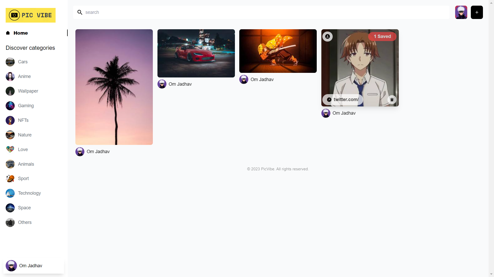

# PicVibe

Welcome to PicVibe, where creativity meets inspiration. Discover a vast collection of stunning images curated by our passionate community. Create your own personalized boards, save your favorite images, and bring your vision to life. With easy image downloads, finding and organizing your visual inspiration has never been easier. Join us and unlock a world of endless possibilities for your creative journey.
### Project Features:

- Login/ Logout function using Google-oauth
- Auto updated feed presented in a masonry layout
- Ability to download and save posts
- Post and delete function
- Search by category, post name or description
- Categorised posts
- Commenting function
- Related posts under main post

## Authors

- [@omjadhav1](https://github.com/OmJadhav1/)

## 🔗 Links

## Credit

This project was built following a tutorial by JavaScript Mastery. It can be found [here](https://youtu.be/1RHDhtbqo94) if you'd like to give it a try.
